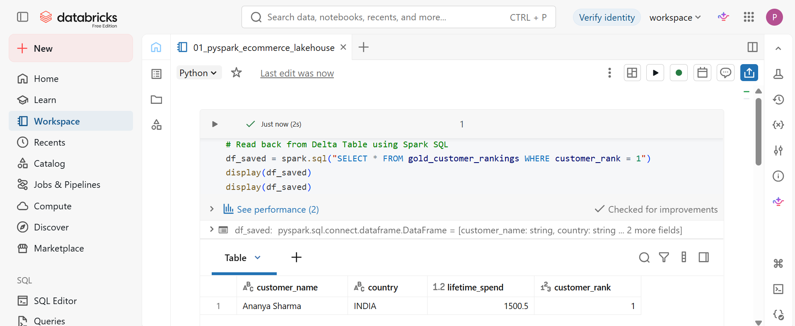

# ⚡ PySpark & Databricks Medallion Architecture Lakehouse

## 🎯 Overview
This project demonstrates an end-to-end Big Data ETL pipeline built on **Databricks** using **PySpark** and **Delta Lake**. The pipeline processes raw e-commerce transaction logs through a 3-tier **Medallion Lakehouse Architecture** (Bronze ➔ Silver ➔ Gold) to generate executive-level analytics.

---

## 🏗️ Medallion Architecture Design

* 🥉 **Bronze Layer (Raw Ingestion):** Ingests raw JSON event logs using explicit `StructType` schema enforcement for optimal memory utilization and appends ingestion metadata timestamps.
* 🥈 **Silver Layer (Data Cleansing & Transformation):** Standardizes data types, trims whitespace, standardizes string casing (`trim`, `initcap`, `lower`), filters out cancelled orders, and calculates derived revenue metrics (`unit_price * quantity`).
* 🥇 **Gold Layer (Aggregations & Delta Lake Persistence):** Performs multi-node grouped aggregations and distributed windowing operations (`dense_rank()`) to rank top spending customers, storing the output in ACID-compliant **Delta Lake** tables.

---

## 🛠️ Tech Stack & Tools
* **Platform:** Databricks
* **Engine:** Apache Spark (PySpark)
* **Storage Format:** Delta Lake
* **Language:** Python, Spark SQL

---

## 📊 Pipeline Execution & Results

### Top Customer Lifetime Spend Query (Spark SQL)

---

## 💻 Code Structure
The complete PySpark ETL code is available in [`01_pyspark_ecommerce_lakehouse.py`](./01_pyspark_ecommerce_lakehouse.py).
